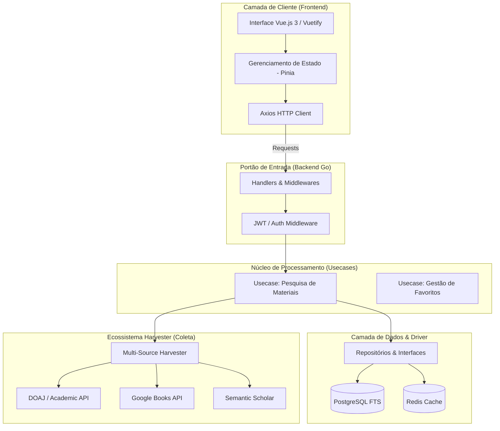
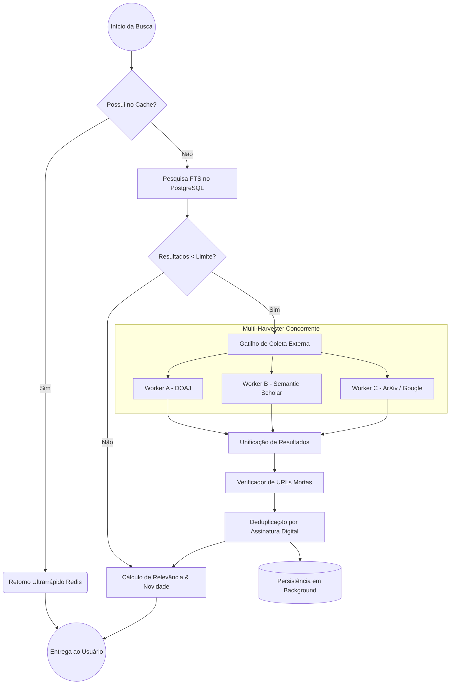

<div align="center">
  

  <br>

  [](https://vuejs.org/)
  [](https://go.dev/)
  [](https://www.postgresql.org/)
  [](https://redis.io/)
  [](https://www.docker.com/)

  <strong>A plataforma que unifica o acesso à ciência. O Acervus Core utiliza algoritmos avançados de busca e inteligência concorrente para consolidar milhões de livros e artigos acadêmicos em um ecossistema intuitivo e ultra-rápido.</strong>

  <br>

  <a href="#-core-engine">💡 Funcionalidades</a> •
  <a href="#-arquitetura-e-engenharia-de-dados">⚙️ Arquitetura</a> •
  <a href="#-como-rodar-o-projeto">🚀 Início Rápido</a>
</div>

---

# 📖 PARTE I: VISÃO GERAL

O cenário acadêmico atual sofre com a fragmentação extrema. Livros, artigos científicos e teses de mestrado estão isolados em múltiplos silos que não se comunicam. 

O **Acervus Core**, desenvolvido como projeto de TCC em Sistemas de Informação pela **Universidade Federal da Grande Dourados (UFGD)**, surge para quebrar essas barreiras. Ele não é apenas uma biblioteca; é um motor de busca de alta precisão que atua como um hub centralizado, coletando, purificando e categorizando materiais de bases mundiais em tempo real.

## ✨ Core Engine: O Coração do Sistema

A plataforma foi reconstruída para oferecer uma experiência "Premium" focada em performance e precisão científica.

### 🔍 Busca de Precisão Cirúrgica (Lógica AND)
Implementamos um motor de **Full-Text Search (FTS)** inteligente no PostgreSQL. Diferente de buscadores comuns que trazem resultados irrelevantes, o Acervus Core utiliza lógica estrita de interseção (**AND**):
- **O que significa?** Se você busca "Engenharia de Software", o sistema garante que apenas materiais que contenham ambos os termos sejam exibidos em rank prioritário.
- **Natural Language Handling**: Suporte nativo para linguagem natural, ignorando "stop-words" e focando no que realmente importa.

### 🤖 Multi-Source Harvesting (7 APIs Integradas)
Nosso sistema de coleta concorrente varre as maiores bibliotecas do mundo simultaneamente:
- **DOAJ (Novo)**: Acesso direto ao maior diretório de artigos científicos de acesso aberto, com foco em materiais em Português.
- **Google Books, Semantic Scholar, ArXiv, Open Library, CAPES e Gutendex**.

### 🎨 Experiência de Estudo Premium
- **Interface Glassmorphism**: Design inspirado no ecossistema iOS, com transparências fluidas e transições suaves.
- **Gerador de Citações Pro**: Gere citações automáticas em formatos **ABNT, APA e BibTeX** com um clique, através de um modal flutuante de última geração.
- **Paginação Inteligente**: Os filtros nunca são perdidos durante a navegação. O sistema preserva o estado da sua pesquisa mesmo durante o scroll infinito.

---

# ⚙️ PARTE II: TÉCNICA E ENGENHARIA

A arquitetura foi projetada seguindo os princípios da **Clean Architecture**, garantindo que o sistema seja escalável, testável e extremamente leve.

## 🏗️ Arquitetura e Engenharia de Dados

O Acervus Core foi construído sobre o princípio da **Alta Disponibilidade** e **Baixa Latência**. Abaixo, detalhamos como o fluxo de informação cruza as camadas do sistema.

### 1. Visão Geral da Arquitetura (Clean Architecture)
O sistema segue os preceitos da Arquitetura Limpa em Go, isolando a regra de negócio dos detalhes de infraestrutura (Banco de Dados e APIs Externas).



### 2. O Pipeline Inteligente de Busca
Diferente de bibliotecas convencionais, o Acervus Core utiliza um pipeline híbrido e concorrente para garantir que o usuário nunca fique sem resultados.



### 3. Ecossistema de Fontes (Harvesters)

| Provedor | Tipo de Acervo | Foco Principal |
| :--- | :--- | :--- |
| **DOAJ** | Acadêmico | Artigos científicos em Português |
| **Google Books** | Digital | Ebooks e literatura mundial |
| **Semantic Scholar** | Científico (IA) | Pesquisas de impacto |
| **ArXiv** | Tecnologia | Ciência da computação e física |
| **CAPES** | Brasileiro | Teses e dissertações nacionais |
| **Open Library** | Domínio Público | Clássicos universais |
| **Gutendex** | Literatura | Projetos educacionais |

---

# 🚀 PARTE III: INSTALAÇÃO E DEPLOY

O Acervus Core é **Docker Ready**. Você pode subir todo o ecossistema (Frontend, Backend, Postgres, Redis) em menos de 2 minutos.

## 🐳 Rodando Localmente (Recomendado)

```powershell
docker-compose up --build
```
- **Interface Web**: `http://localhost:8082`
- **Porta Backend**: `8080` (Proxied via `8082` no container)

## ☁️ Cloud Deployment (Render)
Este repositório está configurado para deploy automático no **Render**. Ele utiliza o `render.yaml` (Blueprint) para provisionar o banco PostgreSQL, o cache Redis e as instâncias Docker de forma orquestrada.

---

# 📄 LICENÇA E CRÉDITOS

Projeto desenvolvido por **Gabriel** (GabrielHJM) como requisito para o TCC de Sistemas de Informação na **UFGD**.

---
<div align="center">
  Feito com ❤️ por acadêmicos para acadêmicos.
</div>
