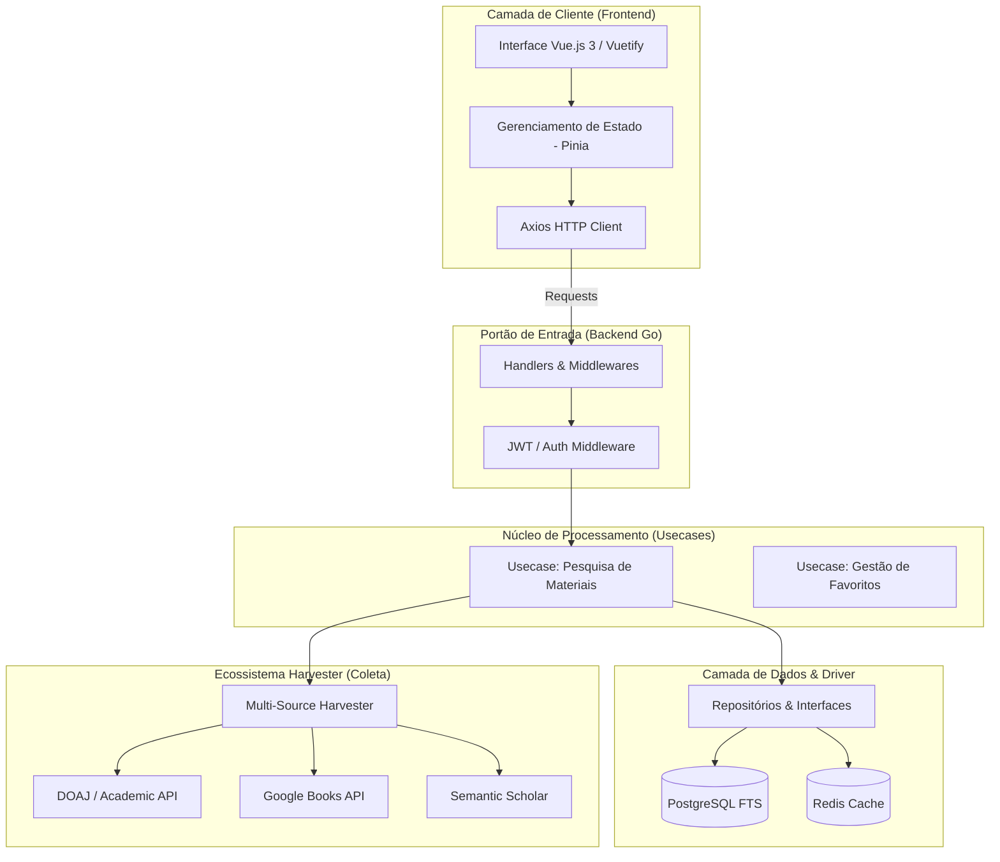
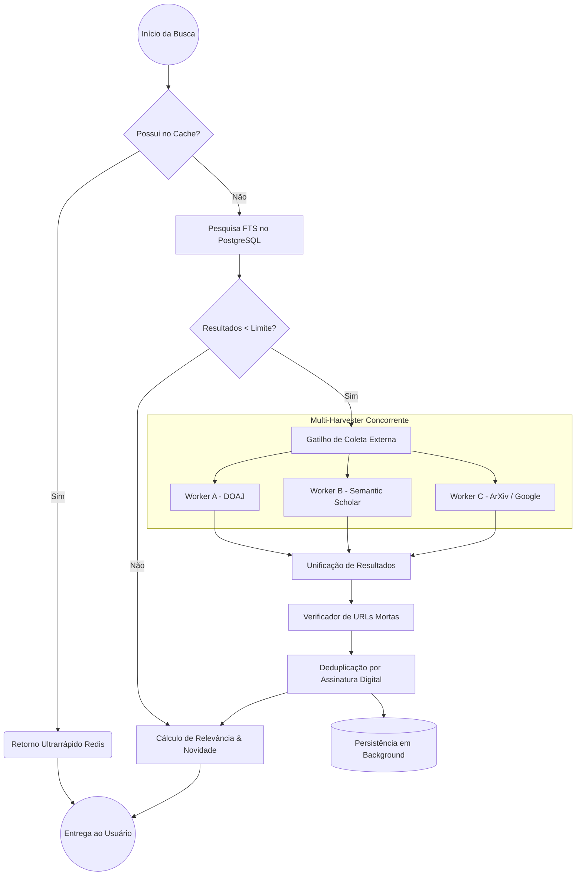

<div align="center">
  

  <br>

  [](https://vuejs.org/)
  [](https://go.dev/)
  [](https://www.postgresql.org/)
  [](https://redis.io/)

    <strong>O Acervus Core unifica acervos acadêmicos em uma única plataforma inteligente. Com arquitetura robusta em Go, Vue.js e PostgreSQL, ele moderniza a experiência de pesquisa e estudo digital.</strong>

  <a href="#-como-rodar-o-projeto">🚀 Começar Agora</a> •
  <a href="#-arquitetura-do-sistema">⚙️ Arquitetura</a> •
  <a href="#-funcionalidades-de-destaque">✨ Funcionalidades</a>
</div>

---

# 📖 PARTE I: APRESENTAÇÃO DO PROJETO

## O Resgate do Conhecimento Centralizado
O cenário acadêmico atual sofre com a fragmentação do conhecimento: livros, artigos e teses estão espalhados em múltiplos repositórios que não se comunicam. 

Desenvolvido como Trabalho de Conclusão de Curso (TCC) em Sistemas de Informação pela Universidade Federal da Grande Dourados (UFGD), este projeto resolve esse problema. A plataforma atua como um hub inteligente, unificando o acervo de diversas fontes (Google Books, ArXiv, CAPES, Semantic Scholar) em um ecossistema ágil e focado na experiência do estudante.

**🔗 Repositório Oficial:** [GabrielHJM/BIBLIOTECA-DIGITAL-ACERVO-UFGD](https://github.com/GabrielHJM/BIBLIOTECA-DIGITAL-ACERVO-UFGD)

## 💻 Telas e Interface (PWA Ready)

A interface foi projetada como uma *Single-Page Application* (SPA) limpa, livre de distrações e orientada ao aprendizado.

| Dashboard & Explorar | Leitura & Estudo | Ferramentas Ativas |
| :---: | :---: | :---: |
|  |  |  |
| *Vitrine inteligente e busca em tempo real.* | *Consumo imersivo do material.* | *Anotações, flashcards e gamificação.* |

> **Nota para deploy:** Adicione prints reais das telas na pasta `frontend/src/assets/images/site-images/` para ilustrar a documentação perfeitamente.

## ✨ Funcionalidades de Destaque
- 🤖 **Multi-Harvester Automático:** Robôs em *background* sincronizam dados continuamente de fontes externas.
- 🔍 **Full-Text Search (FTS):** Motor de busca ultrarrápido nativo do PostgreSQL.
- 📚 **Espaço de Estudo:** Gestão de Flashcards, histórico de leitura e painel de anotações.

---

# ⚙️ PARTE II: ESPECIFICAÇÕES TÉCNICAS

O ecossistema foi projetado utilizando *Clean Architecture*, garantindo alta concorrência, baixo uso de memória e escalabilidade.

## 🛠️ Stack Tecnológica

<div align="center">
  <table>
    <tr>
      <td align="center" width="33%"><b>Frontend (Port: 8081)</b><br><br>Vue.js 3<br>Vuetify 3<br>Vue Router<br>Service Workers (PWA)</td>
      <td align="center" width="33%"><b>Backend (Port: 8080)</b><br><br>Golang 1.25<br>Clean Architecture<br>JWT & Rate Limiting</td>
      <td align="center" width="33%"><b>Database & Infra</b><br><br>PostgreSQL (FTS)<br>Redis (Cache)<br>Swagger (Docs)<br>Node.js (Concurrently)</td>
    </tr>
  </table>
</div>

## 🏗️ Arquitetura e Engenharia de Dados

O Acervus Core foi construído sobre o princípio da **Alta Disponibilidade** e **Baixa Latência**. Abaixo, detalhamos como o fluxo de informação cruza as camadas do sistema.

### 1. Visão Geral da Arquitetura (Clean Architecture)
O sistema segue os preceitos da Arquitetura Limpa em Go, isolando a regra de negócio dos detalhes de infraestrutura (Banco de Dados e APIs Externas).



### 2. O Pipeline Inteligente de Busca
Diferente de bibliotecas convencionais, o Acervus Core utiliza um pipeline híbrido e concorrente para garantir que o usuário nunca fique sem resultados.



### 3. Ecossistema de Fontes (Harvesters)
Atualmente, o Acervus Core atua como um hub para **7 grandes bases de conhecimento** mundiais, priorizando o idioma Português em suas expansões de busca:

| Provedor | Tipo de Acervo | Foco |
| :--- | :--- | :--- |
| **DOAJ** | Acadêmico / Científico | Artigos e Periódicos em Português |
| **Google Books** | Digital / Ebooks | Livros e Literaturas Diversas |
| **Semantic Scholar** | Científico (IA) | Pesquisas de Alto Impacto |
| **ArXiv** | Exatas / Tecnologia | Pre-prints técnicos e Ciência |
| **CAPES** | Brasileiro / Acadêmico | Dissertações e Teses |
| **Open Library** | Domínio Público | Clássicos e Acervos do Mundo |
| **Gutendex** | Literatura Clássica | eBooks Gratuitos e Educacionais |


---

# 🚀 PARTE III: COMO RODAR E FAZER DEPLOY

O sistema agora possui integração completa com **Docker**, facilitando tanto o desenvolvimento local quanto a publicação online.

## 🐳 Rodando Localmente com Docker (Recomendado)

Para subir o ecossistema completo (Frontend + Backend + Banco de Dados) com um único comando:

```powershell
docker-compose up --build
```

- **Frontend & Backend:** [http://localhost:8082](http://localhost:8082)
- **Banco de Dados:** Rodando no container (porta interna 5432, externa 5433).

## ☁️ Deploy Público (Render)

Este repositório está pronto para deploy automático no **Render** via Blueprint:

1.  Crie um novo **Blueprint** no dashboard do Render.
2.  Conecte este repositório.
3.  O Render configurará automaticamente o Web Service (Docker) e o PostgreSQL.

---

# 🧪 PARTE IV: CONTRIBUIÇÃO E TESTES

## 🛠️ Desenvolvimento Manual (Sem Docker)

### Backend
```powershell
cd backend
go run cmd/server/main.go
```

### Frontend
```powershell
cd frontend
npm install
npm run serve
```

---

## 📄 Licença
Desenvolvido por **Gabriel** como projeto de TCC - Sistemas de Informação - UFGD.
