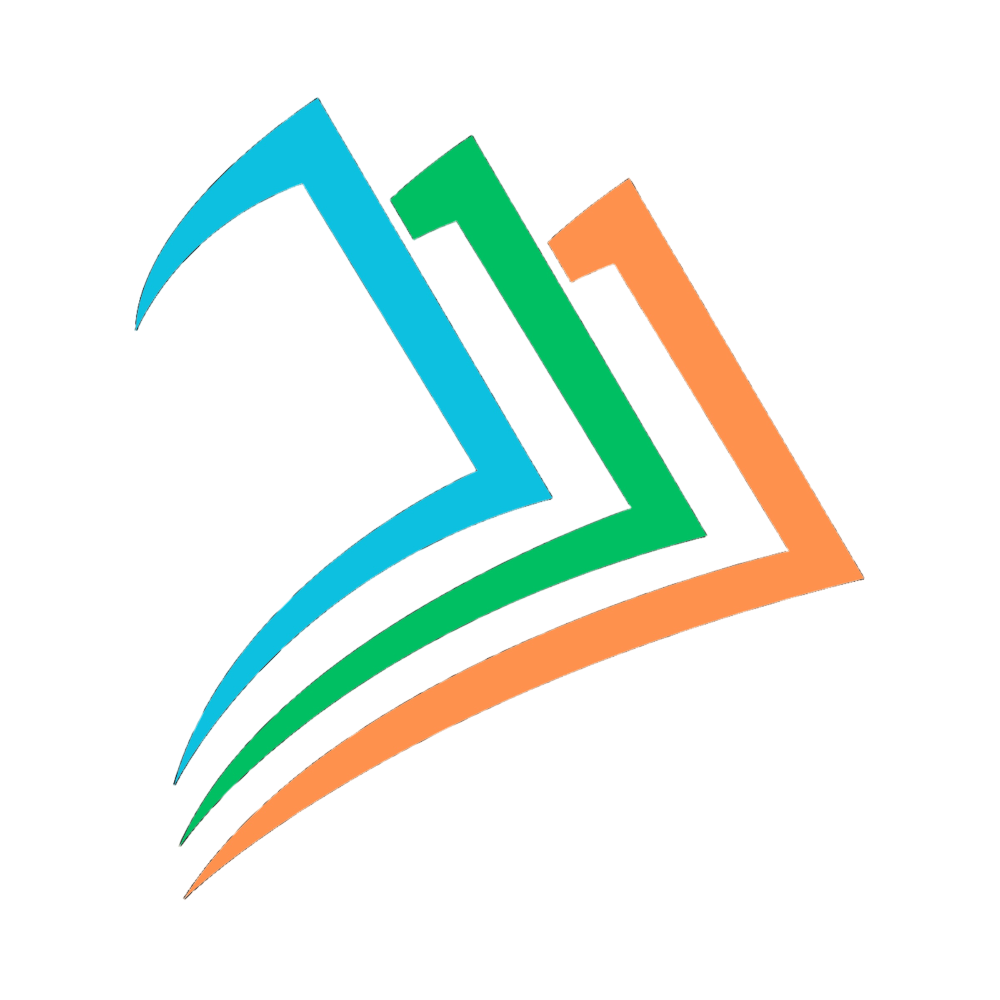
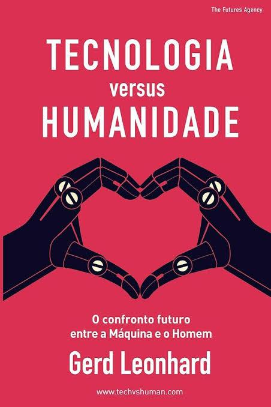
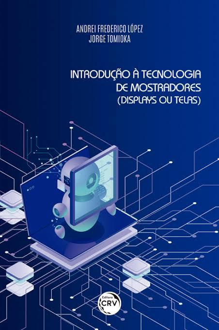

<div align="center">
  

  <br>

  [](https://vuejs.org/)
  [](https://go.dev/)
  [](https://www.postgresql.org/)
  [](https://redis.io/)

  <p align="center">
    <strong>A Biblioteca Digital Colaborativa unifica acervos acadêmicos da UFGD em uma única plataforma. Com arquitetura robusta em Go, Vue.js e PostgreSQL, ela moderniza a pesquisa. O sistema democratiza o acesso à informação, centralizando buscas e a leitura de materiais para transformar o estudo universitário de forma ágil, eficiente e inovadora.</strong>
  </p>

  <a href="#-como-rodar-o-projeto">🚀 Começar Agora</a> •
  <a href="#-arquitetura-do-sistema">⚙️ Arquitetura</a> •
  <a href="#-funcionalidades-de-destaque">✨ Funcionalidades</a>
</div>

---

# 📖 PARTE I: APRESENTAÇÃO DO PROJETO

## O Resgate do Conhecimento Centralizado
O cenário acadêmico atual sofre com a fragmentação do conhecimento: livros, artigos e teses estão espalhados em múltiplos repositórios que não se comunicam. 

Desenvolvido como Trabalho de Conclusão de Curso (TCC) em Sistemas de Informação pela Universidade Federal da Grande Dourados (UFGD), este projeto resolve esse problema. A plataforma atua como um hub inteligente, unificando o acervo de diversas fontes (Google Books, ArXiv, CAPES, Semantic Scholar) em um ecossistema ágil e focado na experiência do estudante.

**🔗 Repositório Oficial:** [GabrielHJM/BIBLIOTECA-DIGITAL-ACERVO-UFGD](https://github.com/GabrielHJM/BIBLIOTECA-DIGITAL-ACERVO-UFGD)

## 💻 Telas e Interface (PWA Ready)

A interface foi projetada como uma *Single-Page Application* (SPA) limpa, livre de distrações e orientada ao aprendizado.

| Dashboard & Explorar | Leitura & Estudo | Ferramentas Ativas |
| :---: | :---: | :---: |
|  |  |  |
| *Vitrine inteligente e busca em tempo real.* | *Consumo imersivo do material.* | *Anotações, flashcards e gamificação.* |

> **Nota para deploy:** Adicione prints reais das telas na pasta `frontend/src/assets/images/site-images/` para ilustrar a documentação perfeitamente.

## ✨ Funcionalidades de Destaque
- 🤖 **Multi-Harvester Automático:** Robôs em *background* sincronizam dados continuamente de fontes externas.
- 🔍 **Full-Text Search (FTS):** Motor de busca ultrarrápido nativo do PostgreSQL.
- 📚 **Espaço de Estudo:** Gestão de Flashcards, histórico de leitura e painel de anotações.

---

# ⚙️ PARTE II: ESPECIFICAÇÕES TÉCNICAS

O ecossistema foi projetado utilizando *Clean Architecture*, garantindo alta concorrência, baixo uso de memória e escalabilidade.

## 🛠️ Stack Tecnológica

<div align="center">
  <table>
    <tr>
      <td align="center" width="33%"><b>Frontend (Port: 8081)</b><br><br>Vue.js 3<br>Vuetify 3<br>Vue Router<br>Service Workers (PWA)</td>
      <td align="center" width="33%"><b>Backend (Port: 8080)</b><br><br>Golang 1.25<br>Clean Architecture<br>JWT & Rate Limiting</td>
      <td align="center" width="33%"><b>Database & Infra</b><br><br>PostgreSQL (FTS)<br>Redis (Cache)<br>Swagger (Docs)<br>Node.js (Concurrently)</td>
    </tr>
  </table>
</div>

## 🏗️ Arquitetura do Sistema

Os motores de Front e Back rodam de forma independente, comunicando-se via API RESTful.

```mermaid
graph TD
    subgraph Frontend [Vue.js PWA]
        UI[Views & Components]
        API_Client[Axios Client]
    end

    subgraph Backend [Golang Clean API]
        HND[Handlers & Middlewares]
        UC[Usecases]
        REP[Postgres & Redis Repositories]
        HARV[Multi-Harvester CRON]
    end

    subgraph External [APIs Externas]
        GB[Google Books]
        ARX[ArXiv]
        CAP[CAPES / Semantic Scholar]
    end

    UI --> API_Client
    API_Client -- JSON HTTP --> HND
    HND --> UC
    UC --> REP
    HARV -- Fetch Background --> GB & ARX & CAP
    HARV -- Ingest --> REP
