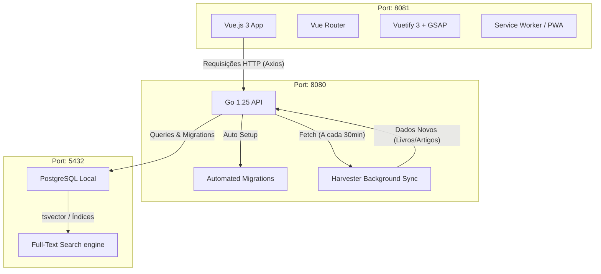

# Acervus Core - Ecossistema do Projeto

Bem-vindo à documentação completa do ecossistema do **Acervus Core**. Este documento detalha de ponta a ponta o funcionamento, as tecnologias e as funcionalidades deste projeto. O sistema foi projetado para ser **Native-First**, rápido, fácil de rodar localmente e livre de configurações complexas (como Docker).

---

## 🏗️ 1. Arquitetura Geral do Sistema

O projeto é dividido em duas partes principais que rodam de forma independente, mas se comunicam via API RESTful.



---

## 🚀 2. Como Rodar o Projeto (Zero Config)

Toda a complexidade de setup foi abstraída. Desde que você tenha **Node.js**, **Go** e **PostgreSQL** instalados, o comando principal faz tudo.

1. Instale todas as dependências de ambos os lados:
   ```bash
   npm run install-all
   ```
2. Inicialize o projeto de forma unificada (Frontend + Backend juntos usando `concurrently`):
   ```bash
   npm start
   ```

Acessos Locais:
- **Aplicação Web:** [http://localhost:8081](http://localhost:8081)
- **Documentação da API (Swagger):** [http://localhost:8080/swagger/index.html](http://localhost:8080/swagger/index.html)

**Credenciais de Teste:**
* **E-mail:** `gabriel@biblioteca.com`
* **Senha:** `123456`

---

## 💻 3. O Frontend (Interface de Usuário)

O frontend foi desenvolvido com foco em performance e uma UI interativa e moderna.

### Tecnologias:
- **Vue.js 3:** Framework reativo e moderno.
- **Vuetify 3:** Biblioteca de componentes de UI padronizada.
- **GSAP:** Biblioteca profissional de animações para micro-interações.
- **Axios:** Para comunicação assíncrona com o backend.
- **PWA Ready:** Possui um registro nativo de *Service Worker*, permitindo que a aplicação seja "instalada" e funcione com suporte offline no futuro.

### Telas e Funcionalidades:
O Vue Router gerencia dezenas de telas, incluindo:
- **Home & Dashboard:** Paineis de entrada para visões gerais de leitura e métricas.
- **Explore:** Descoberta de novos materiais com buscas rápidas.
- **Estudo:** Interface dedicada para leitura e consumo do material.
- **Anotações & Flashcards:** Ferramentas integradas para registrar ideias e memorização de conteúdo.
- **Favoritos:** Gerenciador das obras salvas pelo usuário.
- **Perfil & AdminDashboard:** Edição de dados do usuário e painel de administração geral do sistema.

---

## ⚙️ 4. O Backend (Regras de Negócio e API)

O backend é construído em **Go (Golang) 1.25**, focado na máxima eficiência e uso extremamente baixo de memória, suportando alta concorrência. Ele adota um padrão de arquitetura dividida em *Domain, Repository, Usecase e Handler*.

### Destaques e Diferenciais:

1. **Auto-Migração Inteligente:**
   O Go cria e gerencia as tabelas no PostgreSQL dinamicamente no momento do boot. Tudo, desde `usuarios` até `amizades` e `mensagens`, é provisionado se não existir, evitando a necessidade de scripts manuais.

2. **Harvester (Sincronização em Segundo Plano):**
   O backend tem uma _goroutine_ que roda a cada 30 minutos capturando livros e artigos de várias APIs externas (como CAPES, Google Books, ArXiv) e popula o banco de dados automaticamente nas categorias pré-definidas (Saúde Pública, Direito, Tecnologia, etc.).

3. **Busca Avançada Otimizada (FTS - Full-Text Search):**
   Utiliza a extensão `unaccent` e vetores de texto (`tsvector`) no PostgreSQL (idioma português) com pesos para diferentes áreas (*A* para Título, *B* para Autor, *C* para Descrição). Isso torna a barra de busca incrivelmente rápida e resistente a erros de acentuação/digitação.

4. **Tratamento Seguro de Dados (Middlewares):**
   A API implementa middlewares modernos incluindo Logs (`zap`), Rate Limiting (prevenindo abusos), CORS configurado e Segurança de Cabeçalhos HTTP avançada. O Cache pode operar internamente na memória ou se conectar ao *Redis* de acordo com as variáveis de ambiente.

### Estrutura do Banco de Dados:
A automação garante o ecossistema das seguintes entidades principais:
- **Usuários, Interesses, Amizades e Mensagens.**
- **Materiais Acadêmicos** (com controle de curadoria, categorias, autores).
- **Relacionais de Estudo:** Histórico de Leitura, Avaliações, Favoritos.
- **Ferramentas Pessoais:** Flashcards, Anotações, Empréstimos.

---

## 🔧 5. Variáveis de Ambiente e Configuração

Na inicialização, o backend procura nativamente pelo arquivo `.env`. Se ele não existir, ele usará os recursos padrão do sistema (Postgres via `localhost`). É possível expandir a configuração para adicionar URLs do Redis ou chaves específicas para as APIs externas do Harvester.

---

Esta plataforma é um ecossistema de ponta a ponta inteligente: o Frontend oferece uma experiência rápida como aplicativo (PWA com animações fluídas) sob a marca **Acervus Core**, e o Backend Go provê escalabilidade corporativa puxando dados do mundo acadêmico automaticamente de forma agendada (_Harvester_), centralizando perfeitamente na experiência de autoestudo livre e limpa.
